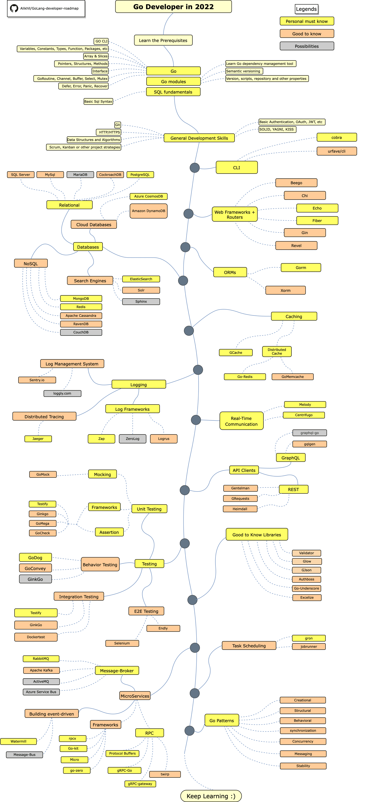

# خارطة طريق لمطور Go

> خارطة طريق لتصبح مطور [Go](https://golang.org/) في 2021 

أدناه يمكنك العثور على مخطط يوضح المسارات التي يمكنك أن تسلكها والمكتبات التي ترغب في تعلمها لتصبح مطور Go.
لقد صنعت هذا المخطط كنصيحة او اجابة لكل من يسألني "*ما الشيء التالي الذي يجب تعلمه كمطور Go ؟*"

[简体中文版](./i18n/zh-CN/ReadMe-zh-CN.md)
[繁體中文版](./i18n/zh-TW/ReadMe-zh-TW.md)
[日本語版](./i18n/ja-JP/ReadMe-ja-JP.md)
[Versão em Português do Brasil](./i18n/pt-BR/ReadMe-pt-BR.md)
[한국어](./i18n/ko-KR/ReadMe-ko-KR.md)
[Русский](./i18n/ru-RU/ReadMe-ru-RU.md)
[Українська](./i18n/uk-UA/ReadMe-uk-UA.md)
[العربية](i18n/ar-IQ/ReadMe-ar-IQ.md)
## إنكار
> الهدف من خارطة الطريق هذه هو اعطائك فكرة عن ما يدور حولك. الخارطة ستوجهك إذا كنت متحيراً او متشككاً بشأن ما يجب أن تتعلمه في الخطوة القادمة. عوضا عن تشجيعك على اختيار ما هو شائع و عصري. يجب أن تنمي بعض الفهم عن سبب ملاءمة إحدى الأدوات لبعض الحالات أكثر من الأخرى وتذكر أن الأنتشار والعصرية لا يعنيان دائمًا أنه الأنسب لانجاز المهمة 

## أعطني نجمة :star:

إذا كنت تحب هذا المشروع أو تستخدمه للتعلم أو شيء اخر، فيرجى إعطائه نجمة. شكرا!

## خارطة الطريق

## مصادر
1. المتطلبات الاساسية 

   - [Go](https://golangbot.com/)
   - [Go Modules](https://blog.golang.org/using-go-modules)
   - [SQL](https://www.w3schools.com/sql/default.asp)

2. مهارات عامة في تطوير البرمجيات
   - تعلم Git، اصنع بعض المستودعات على GitHub، شارك اكوادك مع اناس اخرين.

   - تعرف على بروتوكول HTTP(S)، طرق الطلب (GET, POST, PUT, PATCH, DELETE, OPTIONS)
   - لا تخف من استعمال جوجل، [البحث الفعال مع جوجل](http://www.powersearchingwithgoogle.com/)
   - اقرأ بعض الكتب عن الخوارزميات وهياكل البيانات 
   - تعلم كيفية تنفيذ مصادقة بسيطة (Authentication)
   - المبادئ الصلبة (Solid principles)، البنية او الهيكل (architectural)، انماط التصميم (design patterns)، كود تصحيح الاخطاء (ecc)
   - اساسيات اختبار البرمجيات (unit, integration, e2e)

3. أدوات CLI 
   1. [cobra](https://github.com/spf13/cobra)
   2. [urfave/cli](https://github.com/urfave/cli)

4.  أطر الويب (Web Frameworks) + الموجهات (Routers)

   1. [Beego](https://github.com/beego/beego)
   2. [Chi](https://github.com/go-chi/chi)
   3. [Echo](https://github.com/labstack/echo)
   4. [Fiber](https://github.com/gofiber/fiber)
   5. [Gin](https://github.com/gin-gonic/gin)
   6. [Revel](https://github.com/revel/revel)

5. قواعد البيانات

   1. علائقية
      1. [SQL Server](https://www.microsoft.com/en-us/sql-server/sql-server-2017)
      2. [PostgreSQL](https://www.postgresql.org/)
      3. [MariaDB](https://mariadb.org/)
      4. [MySQL](https://www.mysql.com/)
      5. [CockroachDB](https://www.cockroachlabs.com/) 
   2. قواعد اليانات السحابية 
      - [CosmosDB](https://docs.microsoft.com/en-us/azure/cosmos-db)
      - [DynamoDB](https://aws.amazon.com/dynamodb/)
   3. محركات البحث 
      - [ElasticSearch](https://www.elastic.co/)
      - [Solr](http://lucene.apache.org/solr/)
      - [Sphinx](http://sphinxsearch.com/)
   4. بدون Sql  
      - [MongoDB](https://www.mongodb.com/)
      - [Redis](https://redis.io/)
      - [Apache Cassandra](http://cassandra.apache.org/)
      - [RavenDB](https://github.com/ravendb/ravendb)
      - [CouchDB](http://couchdb.apache.org/)

6. ORMs

   1. [Gorm](https://github.com/go-gorm/gorm)
   2. [Xorm](https://github.com/go-xorm/xorm)

7. التخزين المؤقت (Caching)

   1. [GCache](https://github.com/bluele/gcache)
   2. ذاكرة التخزين المؤقت الموزعة (Distributed Cache)
      1. [Go-Redis](https://github.com/go-redis/redis)
      2. [GoMemcached](https://github.com/bradfitz/gomemcache)

8. التسجيل (Logging)

   1. أطر السجل (Log Frameworks)
      - [Zap](https://github.com/uber-go/zap)
      - [ZeroLog](https://github.com/rs/zerolog)
      - [Logrus](https://github.com/sirupsen/logrus)
   2. نظام ادارة السجل (Log Management System)
      - [Sentry.io](http://sentry.io)
      - [Loggly.com](https://loggly.com)
   3. التتبع الموزع (Distributed Tracing)
      - [Jaeger](https://www.jaegertracing.io/)

9. الاتصال في الوقت الحقيقي (Real-Time Communication)
   1. [Centrifugo](https://github.com/centrifugal/centrifugo)
   2. [Melody](https://github.com/olahol/melody)

10. عملاء واجهة برنامج التطبيق (API Clients)

    1. REST
       - [Gentleman](https://github.com/h2non/gentleman)
       - [GRequests](https://github.com/kennethreitz/grequests)
       - [heimdall](https://github.com/gojek/heimdall)
    2. [GraphQL](https://graphql.org/)
       - [gqlgen](https://github.com/99designs/gqlgen)
       - [graphql-go](https://github.com/graph-gophers/graphql-go)

11. من الجيد معرفته

    - [Validator](https://github.com/go-playground/validator)
    - [Glow](https://github.com/pytorch/glow)
    - [GJson](https://github.com/tidwall/gjson)
    - [Authboss](https://github.com/volatiletech/authboss)
    - [Go-Underscore](https://github.com/ahl5esoft/golang-underscore)

12. الاختبار

    1. Unit, Behavior, Integration Testing
       1. [GoMock](https://github.com/golang/mock)
       2. [Testify](https://github.com/stretchr/testify)
       3. [GinkGo](https://github.com/onsi/ginkgo)
       4. [GoMega](https://github.com/onsi/gomega)
       5. [GoCheck](https://github.com/go-check/check)
       6. [GoDog](https://github.com/DATA-DOG/godog)
       7. [GoConvey](https://github.com/smartystreets/goconvey)
       8. [Dockertest](https://github.com/ory/dockertest)
    2. اختبارE2E
       - [Selenium](https://github.com/tebeka/selenium)
       - [Endly](https://github.com/viant/endly)

13. جدولة المهام (Task Scheduling)

    - [Gron](https://github.com/roylee0704/gron)
    - [JobRunner](https://github.com/bamzi/jobrunner)
    - [Gocron](https://github.com/go-co-op/gocron)

14. الخدمات المصغرة (MicroServices)

    1. وسيط الرسائل (Message-Broker)
       - [RabbitMQ](https://www.rabbitmq.com/tutorials/tutorial-one-go.html)
       - [Apache Kafka](https://kafka.apache.org/)
       - [ActiveMQ](https://github.com/apache/activemq)
       - [Azure Service Bus](https://docs.microsoft.com/en-us/azure/service-bus-messaging/service-bus-messaging-overview)
    2. بناء رسالة (Building message-driven)
       - [Watermill](https://github.com/ThreeDotsLabs/watermill)
       - [Message-Bus](https://github.com/vardius/message-bus)
    3. أطر العمل
         - [GoKit](https://github.com/go-kit/kit)
         - [go-zero](https://github.com/tal-tech/go-zero)
         - [Micro](https://github.com/micro/go-micro)
         - [rpcx](https://github.com/smallnest/rpcx)
    4. نداء الإجراء البعيد (RPC)
         - [Protocol Buffers](https://github.com/protocolbuffers/protobuf)
         - [gRPC-Go](https://github.com/grpc/grpc-go)
         - [gRPC-Gateway](https://github.com/grpc-ecosystem/grpc-gateway)
         - [Twirp](https://github.com/twitchtv/twirp)

15. [Go-Patterns](https://github.com/tmrts/go-patterns)

## ختام
إذا كنت تعتقد أنه يمكن تحسين خارطة الطريق، نرجو ان تقوم بفتح (pull request) مع كل التحديثات والابلاغ عن أي مشاكل. انا ايضا ساستمر في تطويره لذلك انصح ان تقوم باضافة نجمة حتى تتمكن من العودة وزيارتنا مجددا.

الفكرة مستوحات من  : [ASP.NET Core Developer Roadmap](https://github.com/MoienTajik/AspNetCore-Developer-Roadmap)

## المساهمة
خارطة الطريق تم بنائها باستخدام  [Draw.io](https://www.draw.io/). يمكنك ايجاد ملف المشروع `golang-developer-roadmap.xml` في هذا المستودع . لتعديله، قم بفتح draw.io واضغط **Open Existing Diagram** واختر ملف `xml` وسيقوم بفتح المخطط. عدل عليه، قم بتحديث الصورة في `README` وافتح (PR).
استخرج بصيغة png مع تكبير بنسبة 400% وصغر عن طريق [Compressor.io](https://compressor.io/compress).

- افتح (PR) مع التحسينات 
- ناقش الافكار في خانة المشاكل (issues)
- انشر الكلمة

## الترخيص

