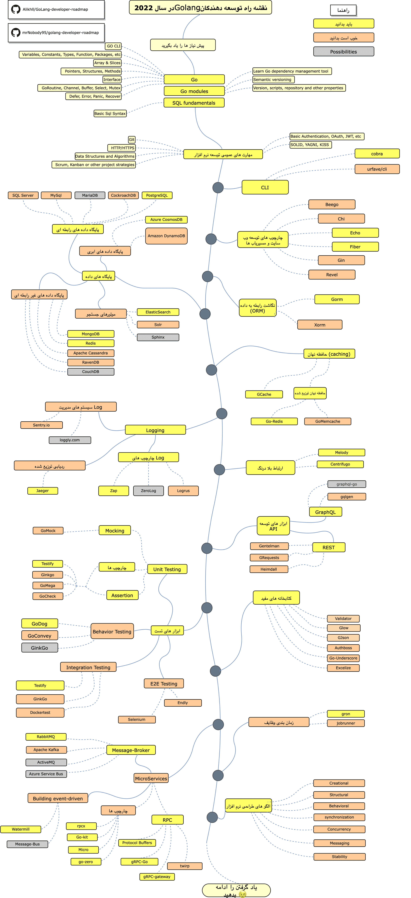

<h1 lang="fa" dir="rtl" align="right">نقشه راه توسعه دهندگاه زبان Go</h1>
<blockquote lang="fa" dir="rtl" align="right">
    
نقشه راه فراگیری زبان <a href="https://golang.org/">Go</a> در سال 2021

</blockquote>

در زیر مسیر راه فراگیری زبان Golang و ابزارها و کتابخانه های مفید برای توسعه نرم افزار بر مبنای این زبان برای شما گرد آوری شده است. من این نقشه راه را برای تمام کانی که از من می پرسند &quot;<em>برای اینکه توسعه دهنده Golang شوم باید چکار کنم؟</em>&quot; آماده کرده ام

    <a href="./i18n/zh-CN/ReadMe-zh-CN.md">简体中文版</a>
    <a href="./i18n/zh-TW/ReadMe-zh-TW.md">繁體中文版</a>
    <a href="./i18n/ja-JP/ReadMe-ja-JP.md">日本語版</a>
    <a href="./i18n/pt-BR/ReadMe-pt-BR.md">Versão em Português do Brasil</a>
    <a href="./i18n/ko-KR/ReadMe-ko-KR.md">한국어</a>
    <a href="./i18n/ru-RU/ReadMe-ru-RU.md">Русский</a>
    <a href="./i18n/uk-UA/ReadMe-uk-UA.md">Українська</a>

    <a href="./i18n/uk-UA/ReadMe-fa-IR.md">فارسی</a>

<h2 lang="fa" dir="rtl" align="right">سلب مسئولیت</h2>
<blockquote lang="fa" dir="rtl" align="right">
    
هدف از ساخت این نقشه راه نشان دادن یک دورنما از ابزارهای توسعه در Golang است. اگر در مورد چیزهایی که باید یاد بگیرید دچار تردید شده اید این نقشه راه به شما کمک می کند. البته اصلا شما را تشویق به استفاده از ابزار خاصی نمیکند. شما خودتان باید درک این را داشته باشید هر ابزاری در چه مواردی از بقیه ابزار ها برتری دارد که برای توسعه نرم افزار خود، متناسب با نیازتان از کدام ابزار استفاده کنید. همیشه ابزار هایی که ترند میشوند لزوما بهترین انتخاب نیستند! 

</blockquote>
<h2 lang="fa" dir="rtl" align="right">ستاره بدهید! :star:</h2>

اگر از این نقشه راه خوشتان آمد یا از آن برای یافتن راه حلی برای توسعه نرم افزار هایتان استفاده م کنید، لطفا به این پروژه ستاره بدهید. متشکرم!

<h2 lang="fa" dir="rtl" align="right">نقشه راه</h2>

<h2 lang="fa" dir="rtl" align="right">منابع</h2>
<ol lang="fa" dir="rtl" align="right">
    <li>
پیش نیازها

        <ul>
            <li><a href="https://golangbot.com/">Go</a></li>
            <li><a href="https://blog.golang.org/using-go-modules">Go Modules</a></li>
            <li><a href="https://www.w3schools.com/sql/default.asp">SQL</a></li>
        </ul>
    </li>
    <li>
مهارت های عمومی توسعه نرم افزار

        <ul>
            <li>فراگیری GIT، ساخت تعدای ریپازیتوری در گیت هاب و به اشتراک گذاری کدهایتان با دیگران</li>
            <li>آشنایی با پروتکل Http(s) و انواع درخواست های آن(GET, POST, PUT, PATCH, DELETE, OPTIONS)</li>
            <li>از استفاده از گوگل نترسید، میتوانیداز <a href="http://www.powersearchingwithgoogle.com/">اینجا</a> مهارت های جستجو قدرتمند رد گوگل را فرا بگیرید</li>
            <li>تعدادی کتاب در باره طراحی الگوریتم و شاختما داده ها بخوانید</li>
            <li>درباره مبانی پیاده سازی احراز هویت مطالبه کنید</li>
            <li>با مفاهیم توسعه نرم افزار بر مبنای SOLID و معماری های توسعه نرم افزار آشنا باشید</li>
            <li>مبانی و انواع روش های تست نرم افزار را بدانید (unit, integration, e2e)</li>
        </ul>
    </li>
    <li>
ابزار های CLI

        <ol>
            <li><a href="https://github.com/spf13/cobra">cobra</a></li>
            <li><a href="https://github.com/urfave/cli">urfave/cli</a></li>
        </ol>
    </li>
    <li>
چارچوب های توسعه وب سایت و مسیریاب ها

        <ol>
            <li><a href="https://github.com/beego/beego">Beego</a></li>
            <li><a href="https://github.com/go-chi/chi">Chi</a></li>
            <li><a href="https://github.com/labstack/echo">Echo</a></li>
            <li><a href="https://github.com/gofiber/fiber">Fiber</a></li>
            <li><a href="https://github.com/gin-gonic/gin">Gin</a></li>
            <li><a href="https://github.com/revel/revel">Revel</a></li>
        </ol>
    </li>
    <li>
پایگاه های داده

        <ol>
            <li>پایگاه داده های رابطه ای<ol>
                <li><a href="https://www.microsoft.com/en-us/sql-server/sql-server-2017">SQL Server</a></li>
                <li><a href="https://www.postgresql.org/">PostgreSQL</a></li>
                <li><a href="https://mariadb.org/">MariaDB</a></li>
                <li><a href="https://www.mysql.com/">MySQL</a></li>
                <li><a href="https://www.cockroachlabs.com/">CockroachDB</a> </li>
            </ol>
            </li>
            <li>پایگاه داده های ابری<ul>
                <li><a href="https://docs.microsoft.com/en-us/azure/cosmos-db">CosmosDB</a></li>
                <li><a href="https://aws.amazon.com/dynamodb/">DynamoDB</a></li>
            </ul>
            </li>
            <li>موتورهای جستجو<ul>
                <li><a href="https://www.elastic.co/">ElasticSearch</a></li>
                <li><a href="http://lucene.apache.org/solr/">Solr</a></li>
                <li><a href="http://sphinxsearch.com/">Sphinx</a></li>
            </ul>
            </li>
            <li>پایگاه داده های غیر رابطه ای<ul>
                <li><a href="https://www.mongodb.com/">MongoDB</a></li>
                <li><a href="https://redis.io/">Redis</a></li>
                <li><a href="http://cassandra.apache.org/">Apache Cassandra</a></li>
                <li><a href="https://github.com/ravendb/ravendb">RavenDB</a></li>
                <li><a href="http://couchdb.apache.org/">CouchDB</a></li>
            </ul>
            </li>
        </ol>
    </li>
    <li>
نگاشت داده به رابطه(ORM)

        <ol>
            <li><a href="https://github.com/go-gorm/gorm">Gorm</a></li>
            <li><a href="https://github.com/go-xorm/xorm">Xorm</a></li>
        </ol>
    </li>
    <li>
(caching)حافظه نهان

        <ol>
            <li><a href="https://github.com/bluele/gcache">GCache</a></li>
            <li>حافظه نهان توزیع شده<ol>
                <li><a href="https://github.com/go-redis/redis">Go-Redis</a></li>
                <li><a href="https://github.com/bradfitz/gomemcache">GoMemcached</a></li>
            </ol>
            </li>
        </ol>
    </li>
    <li>
Logging

        <ol>
            <li>چارچوب های Log<ul>
                <li><a href="https://github.com/uber-go/zap">Zap</a></li>
                <li><a href="https://github.com/rs/zerolog">ZeroLog</a></li>
                <li><a href="https://github.com/sirupsen/logrus">Logrus</a></li>
            </ul>
            </li>
            <li>سیستم های مدیریت Log<ul>
                <li><a href="http://sentry.io">Sentry.io</a></li>
                <li><a href="https://loggly.com">Loggly.com</a></li>
            </ul>
            </li>
            <li>ردیابی توزیع شده<ul>
                <li><a href="https://www.jaegertracing.io/">Jaeger</a></li>
            </ul>
            </li>
        </ol>
    </li>
    <li>
ارتباط بی درنگ

        <ol>
            <li><a href="https://github.com/centrifugal/centrifugo">Centrifugo</a></li>
            <li><a href="https://github.com/olahol/melody">Melody</a></li>
        </ol>
    </li>
    <li>
ابزارهای توسعه API

        <ol>
            <li>REST<ul>
                <li><a href="https://github.com/h2non/gentleman">Gentleman</a></li>
                <li><a href="https://github.com/kennethreitz/grequests">GRequests</a></li>
                <li><a href="https://github.com/gojek/heimdall">heimdall</a></li>
            </ul>
            </li>
            <li><a href="https://graphql.org/">GraphQL</a><ul>
                <li><a href="https://github.com/99designs/gqlgen">gqlgen</a></li>
                <li><a href="https://github.com/graph-gophers/graphql-go">graphql-go</a></li>
            </ul>
            </li>
        </ol>
    </li>
    <li>
دانستن موارد زیر نیز خوب است

        <ul>
            <li><a href="https://github.com/go-playground/validator">Validator</a></li>
            <li><a href="https://github.com/pytorch/glow">Glow</a></li>
            <li><a href="https://github.com/tidwall/gjson">GJson</a></li>
            <li><a href="https://github.com/volatiletech/authboss">Authboss</a></li>
            <li><a href="https://github.com/ahl5esoft/golang-underscore">Go-Underscore</a></li>
        </ul>
    </li>
    <li>
Testing

        <ol>
            <li>تست های integration، behavior و unit<ol>
                <li><a href="https://github.com/golang/mock">GoMock</a></li>
                <li><a href="https://github.com/stretchr/testify">Testify</a></li>
                <li><a href="https://github.com/onsi/ginkgo">GinkGo</a></li>
                <li><a href="https://github.com/onsi/gomega">GoMega</a></li>
                <li><a href="https://github.com/go-check/check">GoCheck</a></li>
                <li><a href="https://github.com/DATA-DOG/godog">GoDog</a></li>
                <li><a href="https://github.com/smartystreets/goconvey">GoConvey</a></li>
                <li><a href="https://github.com/ory/dockertest">Dockertest</a></li>
            </ol>
            </li>
            <li>تست E2E<ul>
                <li><a href="https://github.com/tebeka/selenium">Selenium</a></li>
                <li><a href="https://github.com/viant/endly">Endly</a></li>
            </ul>
            </li>
        </ol>
    </li>
    <li>
زمان بندی وظایف

        <ul>
            <li><a href="https://github.com/roylee0704/gron">Gron</a></li>
            <li><a href="https://github.com/bamzi/jobrunner">JobRunner</a></li>
            <li><a href="https://github.com/go-co-op/gocron">Gocron</a></li>
        </ul>
    </li>
    <li>
معماری مایکروسرویس

        <ol>
            <li>Message-Broker<ul>
                <li><a href="https://www.rabbitmq.com/tutorials/tutorial-one-go.html">RabbitMQ</a></li>
                <li><a href="https://kafka.apache.org/">Apache Kafka</a></li>
                <li><a href="https://github.com/apache/activemq">ActiveMQ</a></li>
                <li><a href="https://docs.microsoft.com/en-us/azure/service-bus-messaging/service-bus-messaging-overview">Azure Service Bus</a></li>
            </ul>
            </li>
            <li>ساخت message-driven ها<ul>
                <li><a href="https://github.com/ThreeDotsLabs/watermill">Watermill</a></li>
                <li><a href="https://github.com/vardius/message-bus">Message-Bus</a></li>
            </ul>
            </li>
            <li>چارپوب های توسعه<ul>
                <li><a href="https://github.com/go-kit/kit">GoKit</a></li>
                <li><a href="https://github.com/tal-tech/go-zero">go-zero</a></li>
                <li><a href="https://github.com/micro/go-micro">Micro</a></li>
                <li><a href="https://github.com/smallnest/rpcx">rpcx</a></li>
            </ul>
            </li>
            <li>RPC<ul>
                <li><a href="https://github.com/protocolbuffers/protobuf">Protocol Buffers</a></li>
                <li><a href="https://github.com/grpc/grpc-go">gRPC-Go</a></li>
                <li><a href="https://github.com/grpc-ecosystem/grpc-gateway">gRPC-Gateway</a></li>
                <li><a href="https://github.com/twitchtv/twirp">Twirp</a></li>
            </ul>
            </li>
        </ol>
    </li>
    <li>
<a href="https://github.com/tmrts/go-patterns">الگو های توسعه برنامه در Golang</a>

    </li>
</ol>
<h2 lang="fa" dir="rtl" align="right">جمع بندی</h2>

اگر فکر میکنید که میتوانید این نقشه راه را بهبود بدهید، لطفا تغییرات خود را در قالب یک PR و ثبت یک issue برای ما ارسال کنید. من همواره در تلاش برای بهبود این پروژه هستم، پس میتوانید برا ستاره دادن به این پروژه از تغییرات آیند ه آن باخبر شوید.

ایده گرفته شده از: <a href="https://github.com/MoienTajik/AspNetCore-Developer-Roadmap">نقشه راه توسعه دهنده گان ASP.NET Core</a>

<h2 lang="fa" dir="rtl" align="right">مشارکت</h2>

این نقشه راه با استفاده از <a href="https://www.draw.io/">Draw.io</a> ساخته شده است. شما می تواندی با استفاده از فایل <code>golang-developer-roadmap.xml</code> تغییرات خود را در این پروژه اعمال کنید. برای اعمال تغییرات خود در فایل، پس از ورود به سایت، با کلیک بر روی گزینه <strong>Open Existing Diagram</strong> فایل <code>xml</code> این پروژه را انتخاب کرده و تغییرات را روی آن انجام دهید. شما مختارید هر تغییری را در آن اعمال کنید. بعد از ثبت تغییرات خود، آردس فایل جدید را در ReadMe بروزرسانی کنید و فایل را به همره ReadMe جدید در قالب یک PR برای ما ارسال کنید فراموش نکنید که فایل جدید را در قالب png و با بزرگ نمایی 400% ذخیره کنید. سپس با استفاده از سایت  <a href="https://compressor.io/compress">Compressor.io</a> آن را فشرده کنید.

<ul lang="fa" dir="rtl" align="right">
    <li>یک درخواست PR بر منبای تغییرات بهبود یافته تان ایجاد کنید</li>
    <li>درباره ایده هایتان در issue بحث کنید</li>
    <li>ایده هایتان را گسترش بدهید</li>
</ul>
<h2 lang="fa" dir="rtl" align="right">لایسنس</h2>

