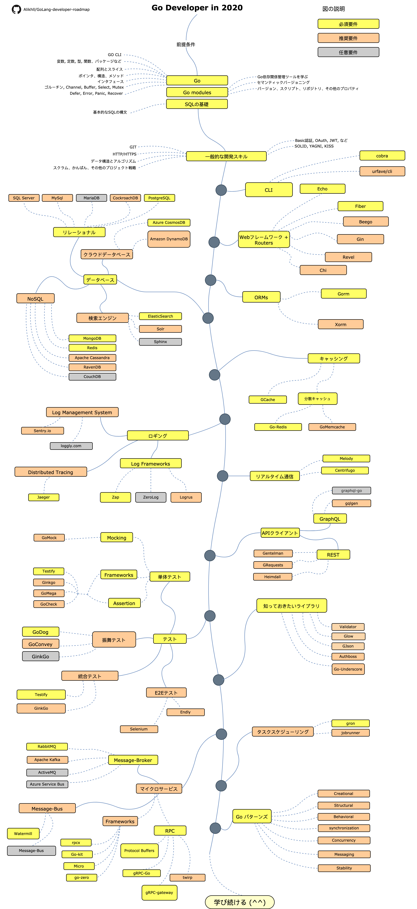

# Go開発者のロードマップ

> 2020年に[Go](https://golang.org/)開発者になるためのロードマップ：

以下に、Go開発者となるために学習したい技術やライブラリを示すチャートを示します。 このチャートは、「*Go開発者として次に学ぶべきことは何ですか？*」と私へ問う人のために作成しました。

[English](../../ReadMe.md)
[简体中文版](../zh-CN/ReadMe-zh-CN.md)
[繁體中文版](../zh-TW/ReadMe-zh-TW.md)
[Versão em Português do Brasil](../pt-BR/ReadMe-pt-BR.md)
[한국어](../ko-KR/ReadMe-ko-KR.md)
[Русский](../ru-RU/ReadMe-ru-RU.md)
[Українська](../uk-UA/ReadMe-uk-UA.md)
[فارسی](../fa-IR/ReadMe-fa-IR.md)

## 免責事項

> このロードマップの目的は、見通しについてのアイデアを提供することです。ロードマップは、誇大広告やトレンディなものを勧めるのではなく、次に何を学ぶべきかについて混乱している場合に役立ちます。あるツールが他のツールよりも他のツールに適している理由について理解を深め、誇大広告やトレンディなことが必ずしも仕事に最適であるとは限らないことを忘れないでください。

## Give a Star! :star:

このプロジェクトが好きな場合、またはこのプロジェクトを使用して解決策を学習または開始する場合は、スターを付けてください。 お願いします！

## ロードマップ

## Resources

1. 前提条件

   - [Go](https://golangbot.com/)
   - [Go Modules](https://blog.golang.org/using-go-modules)
   - [SQL](https://www.w3schools.com/sql/default.asp)

2. 一般的な開発スキル

   - Gitを学ぶ。GitHubでいくつかのリポジトリを作成し、他の人とコードを共有する。
   - HTTP(S)プロトコル、リクエストメソッドを知る (GET, POST, PUT, PATCH, DELETE, OPTIONS)
   - Google検索で疑問を解決できる。
   - アルゴリズムやデータ構造に関する本を何冊か読む。
   - 基本的な認証機能の実装について学ぶ。
   - SOLID原則、アーキテクチャとデザインパターンなど
   - ソフトウェアテストの基礎（ユニットテスト、インテグレーションテスト、e2eテスト）

3. CLIツール
   1. [cobra](https://github.com/spf13/cobra)
   2. [urfave/cli](https://github.com/urfave/cli)

4. Webフレームワーク + Routers

   1. [Beego](https://github.com/astaxie/beego)
   2. [Chi](https://github.com/go-chi/chi)
   3. [Echo](https://github.com/labstack/echo)
   4. [Fiber](https://github.com/gofiber/fiber)
   5. [Gin](https://github.com/gin-gonic/gin)
   6. [Revel](https://github.com/revel/revel)

5. データベース

   1. リレーショナル
      1. [SQL Server](https://www.microsoft.com/en-us/sql-server/sql-server-2017)
      2. [PostgreSQL](https://www.postgresql.org/)
      3. [MariaDB](https://mariadb.org/)
      4. [MySQL](https://www.mysql.com/)
      5. [CockroachDB](https://www.cockroachlabs.com/)
   2. クラウドデータベース
      - [CosmosDB](https://docs.microsoft.com/en-us/azure/cosmos-db)
      - [DynamoDB](https://aws.amazon.com/dynamodb/)
   3. 検索エンジン
      - [ElasticSearch](https://www.elastic.co/)
      - [Solr](http://lucene.apache.org/solr/)
      - [Sphinx](http://sphinxsearch.com/)
   4. NoSQL
      - [MongoDB](https://www.mongodb.com/)
      - [Redis](https://redis.io/)
      - [Apache Cassandra](http://cassandra.apache.org/)
      - [RavenDB](https://github.com/ravendb/ravendb)
      - [CouchDB](http://couchdb.apache.org/)

6. ORMs

   1. [Gorm](https://github.com/jinzhu/gorm)
   2. [Xorm](https://github.com/go-xorm/xorm)

7. キャッシング

   1. [GCache](https://github.com/bluele/gcache)
   2. Distributed Cache
      1. [Go-Redis](https://github.com/go-redis/redis)
      2. [GoMemcached](https://github.com/bradfitz/gomemcache)

8. ロギング

   1. Log Frameworks
      - [Zap](https://github.com/uber-go/zap)
      - [ZeroLog](https://github.com/rs/zerolog)
      - [Logrus](https://github.com/sirupsen/logrus)
   2. Log Management System
      - [Sentry.io](http://sentry.io)
      - [Loggly.com](https://loggly.com)
   3. Distributed Tracing
      - [Jaeger](https://www.jaegertracing.io/)

9. リアルタイム通信
   4. [Socket.IO](https://socket.io/)

10. APIクライアント

    1. REST
       - [Gentleman](https://github.com/h2non/gentleman)
       - [GRequests](https://github.com/kennethreitz/grequests)
       - [heimdall](https://github.com/heimdal/heimdal)
    2. [GraphQL](https://graphql.org/)
       - [gqlgen](https://github.com/99designs/gqlgen)
       - [graphql-go](https://github.com/graph-gophers/graphql-go)

11. 知っておきたいライブラリ

    - [Validator](https://github.com/go-playground/validator)
    - [Glow](https://github.com/pytorch/glow)
    - [GJson](https://github.com/tidwall/gjson)
    - [Authboss](https://github.com/volatiletech/authboss)
    - [Go-Underscore](https://github.com/ahl5esoft/golang-underscore)

12. テスト

    1. Unit, Behavior, Integration Testing
       1. [GoMock](https://github.com/golang/mock)
       2. [Testify](https://github.com/stretchr/testify)
       3. [GinkGo](https://github.com/onsi/ginkgo)
       4. [GoMega](https://github.com/onsi/gomega)
       5. [GoCheck](https://github.com/go-check/check)
       6. [GoDog](https://github.com/DATA-DOG/godog)
       7. [GoConvey](https://github.com/smartystreets/goconvey)
    2. E2E Testing
       - [Selenium](https://github.com/tebeka/selenium)
       - [Endly](https://github.com/viant/endly)

13. タスクスケジューリング

    - [Gron](https://github.com/roylee0704/gron)
    - [JobRunner](https://github.com/bamzi/jobrunner)

14. マイクロサービス

    1. Message-Broker
       - [RabbitMQ](https://www.rabbitmq.com/tutorials/tutorial-one-go.html)
       - [Apache Kafka](https://kafka.apache.org/)
       - [ActiveMQ](https://github.com/apache/activemq)
       - [Azure Service Bus](https://docs.microsoft.com/en-us/azure/service-bus-messaging/service-bus-messaging-overview)
    2. Building message-driven
       - [Watermill](https://github.com/ThreeDotsLabs/watermill)
       - [Message-Bus](https://github.com/vardius/message-bus)
    3. Frameworks
         - [GoKit](https://github.com/go-kit/kit)
         - [go-zero](https://github.com/tal-tech/go-zero)
         - [Micro](https://github.com/micro/go-micro)
         - [rpcx](https://github.com/smallnest/rpcx)
    4. RPC
         - [Protocol Buffers](https://github.com/protocolbuffers/protobuf)
         - [gRPC-Go](https://github.com/grpc/grpc-go)
         - [gRPC-Gateway](https://github.com/grpc-ecosystem/grpc-gateway)
         - [Twirp](https://github.com/twitchtv/twirp)

15. [Go パターンズ](https://github.com/tmrts/go-patterns)

## 最後に

ロードマップを改善できると思われる場合または更新情報がある場合はPRまたはIssueを投稿してください。また、私はこれを改善し続けるので、このリポジトリにスターを付けることを再度オススメします。

アイディア : [ASP.NET Core Developer Roadmap](https://github.com/MoienTajik/AspNetCore-Developer-Roadmap)

## 貢献について

ロードマップは[Draw.io](https://www.draw.io/)を使用して作成されています。プロジェクトファイルは  `golang-developer-roadmap-ja-JP.xml` ファイルにあります。 変更するには、draw.ioを開き、**Open Existing Diagram**をクリックして、プロジェクトで `xml` ファイルを選択すると、ロードマップが開きます。それを更新し、ReadMeの画像をアップロードして更新し、PRを作成します（400％ズームでpngとしてエクスポートし、[Compressor.io](https://compressor.io/compress)で縮小します）

- 改善されたPRを開く
- 課題のアイデアについて話し合う
- 世界に公開する

## ライセンス

