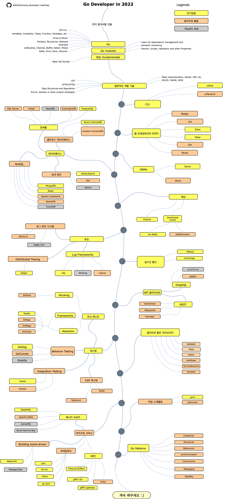

# Go 개발자의 로드맵

>  2020년 [Go] (https://golang.org/) 개발자가 되기 위한 로드맵:

Go 개발자가 되기 위해 학습하고 싶은 기술이나 라이브러리를 보여주는 로드맵입니다. 이 로드맵은 *Go 개발자로서 다음에 배워야 할 게 뭔가요?* 라고 묻는 사람들을 위해 작성되었습니다.

[English](../../ReadMe.md)
[简体中文版](../zh-CN/ReadMe-zh-CN.md)
[繁體中文版](../zh-TW/ReadMe-zh-TW.md)
[日本語版](../ja-JP/ReadMe-ja-JP.md)
[Versão em Português do Brasil](../pt-BR/ReadMe-pt-BR.md)
[Русский](../ru-RU/ReadMe-ru-RU.md)
[Українська](../uk-UA/ReadMe-uk-UA.md)
[فارسی](../fa-IR/ReadMe-fa-IR.md)

# 면책 사항

> 이 로드맵의 목적은 비전을 제공하는 것입니다. 로드맵은 과장광고나 트렌디한 것을 권하는 것이 아니라 다음에 무엇을 배워야 하는지에 대해 혼란스러운 경우에 도움이 됩니다. 어떤 툴이 다른 툴보다 적합한 이유에 대한 이해를 높이고 과장된 내용이나 트렌디한 것이 반드시 일에 최적이라고는 할 순 없습니다. 잊지마세요.

## Give a Star! :star:

이 프로젝트를 좋아하거나, 이 프로젝트를 사용하여 해결책을 학습하거나 시작하려면 스타를 붙이세요. 고마워요!

##로드맵

## Resources

1. 먼저 알아야할 것들

- [Go] (https://golangbot.com/)
- [Go Modules](https://blog.golang.org/using-go-modules)
- [SQL] (https://www.w3schools.com/sql/default.asp)

2. 일반적인 개발 기술

- Git을 배우고 GitHub에서 몇 개의 저장소를 만들어 다른 사람과 코드를 공유합니다.
- HTTP(S) 프로토콜, 요청 메소드(GET, POST, PUT, PATCH, DELETE, OPTIONS) 알아야합니다. 이는 구글링으로 궁금증을 해결할 수 있습니다.
- 알고리즘과 자료 구조에 관한 책을 몇 권 읽습니다.
- 기본적인 인증에 대해 배웁니다.
- SOLID 원칙, 아키텍처와 디자인 패턴 등
- 소프트웨어 테스트의 기초 (유닛 테스트, 인테그레이션 테스트, e2e 테스트)

3. CLI 도구들
   1. [cobra](https://github.com/spf13/cobra)
   2. [urfave/cli](https://github.com/urfave/cli)
4. 웹 프레임워크와 라우터
   1. [Beego](https://github.com/astaxie/beego)
   2. [Chi](https://github.com/go-chi/chi)
   3. [Echo](https://github.com/labstack/echo)
   4. [Fiber](https://github.com/gofiber/fiber)
   5. [Gin](https://github.com/gin-gonic/gin)
   6. [Revel](https://github.com/revel/revel)
5. 데이터베이스
   1. 관계형
      1. [SQL Server](https://www.microsoft.com/en-us/sql-server/sql-server-2017)
      2. [PostgreSQL](https://www.postgresql.org/)
      3. [MariaDB](https://mariadb.org/)
      4. [MySQL](https://www.mysql.com/)
      5. [CockroachDB](https://www.cockroachlabs.com/)
   2. 클라우드 DB
      - [CosmosDB](https://docs.microsoft.com/en-us/azure/cosmos-db)
      - [DynamoDB](https://aws.amazon.com/dynamodb/)
   3. 검색 엔진
      - [ElasticSearch](https://www.elastic.co/)
      - [Solr](http://lucene.apache.org/solr/)
      - [Sphinx](http://sphinxsearch.com/)
   4. NoSQL
      - [MongoDB](https://www.mongodb.com/)
      - [Redis](https://redis.io/)
      - [Apache Cassandra](http://cassandra.apache.org/)
      - [RavenDB](https://github.com/ravendb/ravendb)
      - [CouchDB](http://couchdb.apache.org/)
6. ORMs
   1. [Gorm](https://github.com/go-gorm/gorm)
   2. [Xorm](https://github.com/go-xorm/xorm)
7. 캐싱
   1. [GCache](https://github.com/bluele/gcache)
   2. Distributed Cache
      1. [Go-Redis](https://github.com/go-redis/redis)
      2. [GoMemcached](https://github.com/bradfitz/gomemcache)
8. 로깅
   1. Log Frameworks
      - [Zap](https://github.com/uber-go/zap)
      - [ZeroLog](https://github.com/rs/zerolog)
      - [Logrus](https://github.com/sirupsen/logrus)
   2. Log Management System
      - [Sentry.io](http://sentry.io/)
      - [Loggly.com](https://loggly.com/)
   3. Distributed Tracing
      - [Jaeger](https://www.jaegertracing.io/)
9. 실시간 통신
   1. [Socket.IO](https://socket.io/)
10. API 클라이언트
    1. REST
       - [Gentleman](https://github.com/h2non/gentleman)
       - [GRequests](https://github.com/kennethreitz/grequests)
       - [heimdall](https://github.com/heimdal/heimdal)
    2. GraphQL
       - [gqlgen](https://github.com/99designs/gqlgen)
       - [graphql-go](https://github.com/graph-gophers/graphql-go)
11. 알아두면 좋은 라이브러리
    - [Validator](https://github.com/go-playground/validator)
    - [Glow](https://github.com/pytorch/glow)
    - [GJson](https://github.com/tidwall/gjson)
    - [Authboss](https://github.com/volatiletech/authboss)
    - [Go-Underscore](https://github.com/ahl5esoft/golang-underscore)
12. 테스팅
    1. Unit, Behavior, Integration Testing
       1. [GoMock](https://github.com/golang/mock)
       2. [Testify](https://github.com/stretchr/testify)
       3. [GinkGo](https://github.com/onsi/ginkgo)
       4. [GoMega](https://github.com/onsi/gomega)
       5. [GoCheck](https://github.com/go-check/check)
       6. [GoDog](https://github.com/DATA-DOG/godog)
       7. [GoConvey](https://github.com/smartystreets/goconvey)
    2. E2E Testing
       - [Selenium](https://github.com/tebeka/selenium)
       - [Endly](https://github.com/viant/endly)
13. 작업 스케줄링
    - [Gron](https://github.com/roylee0704/gron)
    - [JobRunner](https://github.com/bamzi/jobrunner)
    - [Gocron](https://github.com/go-co-op/gocron)
14. 마이크로 서비스
    1. 메시지 브로커
       - [RabbitMQ](https://www.rabbitmq.com/tutorials/tutorial-one-go.html)
       - [Apache Kafka](https://kafka.apache.org/)
       - [ActiveMQ](https://github.com/apache/activemq)
       - [Azure Service Bus](https://docs.microsoft.com/en-us/azure/service-bus-messaging/service-bus-messaging-overview)
    2. Building message-driven
       - [Watermill](https://github.com/ThreeDotsLabs/watermill)
       - [Message-Bus](https://github.com/vardius/message-bus)
    3. 프레임워크
       - [GoKit](https://github.com/go-kit/kit)
       - [go-zero](https://github.com/tal-tech/go-zero)
       - [Micro](https://github.com/micro/go-micro)
       - [rpcx](https://github.com/smallnest/rpcx)
    4. RPC
       - [Protocol Buffers](https://github.com/protocolbuffers/protobuf)
       - [gRPC-Go](https://github.com/grpc/grpc-go)
       - [gRPC-Gateway](https://github.com/grpc-ecosystem/grpc-gateway)
       - [Twirp](https://github.com/twitchtv/twirp)
15. [Go-Patterns](https://github.com/tmrts/go-patterns)

## Wrap Up

로드맵을 개선할 수 있다고 생각된다면 PR 또는 이슈를 제출해주세요. 저희는 이것을 계속 개선할 것이기 때문에, 재 방문을 위해 Star를 눌러줄 수 있습니다.

Idea from : [ASP.NET Core Developer Roadmap](https://github.com/MoienTajik/AspNetCore-Developer-Roadmap)

## Contribution

로드맵은 [Draw.io](https://www.draw.io/)를 사용하여 작성되었습니다. 프로젝트 파일은 golang-developer-roadmap.xml 파일에서 찾을 수 있습니다. 수정하려면 draw.io을 열고 **Open Existing Diagram**를 클릭한 다음 프로젝트와 함께 `xml` 파일을 선택하세요. 로드맵을 열어줄 겁니다. 이를 업데이트하고, 리드미(readme)와 함께 업로드한 후 PR을 생성합니다. (png 이미지는 [https://compressor.io/compress](https://compressor.io/compress)를 통해 400% 확대로 압축하여 Export 합니다)

- Open a pull request with improvements
- Discuss ideas in issues
- Spread the word

## License

