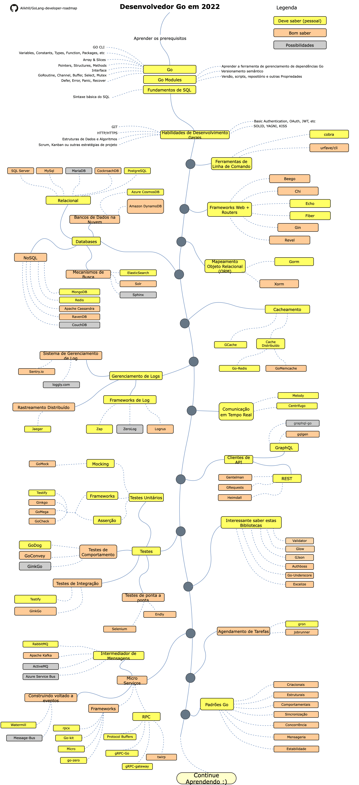

# Roteiro do Desenvolvedor Go

> Roteiro para se tornar um desenvolvedor [Go](https://golang.org/) em 2020:

Abaixo você irá encontrar um gráfico demonstrando os caminhos que você pode tomar e as bibliotecas que você poderia querer aprender para se tornar um desenvolvedor Go. Eu fiz este gráfico como uma dica para todo mundo que me pergunta, "*O que eu deveria aprender na sequência como um desenvolvedor Go?*"

[English](../../ReadMe.md)
[简体中文版](../zh-CN/ReadMe-zh-CN.md)
[繁體中文版](../zh-TW/ReadMe-zh-TW.md)
[日本語版](../ja-JP/ReadMe-ja-JP.md)
[한국어](../ko-KR/ReadMe-ko-KR.md)
[Русский](../ru-RU/ReadMe-ru-RU.md)
[Українська](../uk-UA/ReadMe-uk-UA.md)
[فارسی](../fa-IR/ReadMe-fa-IR.md)

## Aviso Legal

> O propósito deste roteiro é te dar um panorama. O roteiro irá te guiar se você estiver confuso sobre o que aprender na sequência, ao invés de te encorajar a selecionar o que está na moda. Você deve compreender por que uma ferramenta seria melhor para alguns casos do que outra e lembrar que o fato de algo estar na moda não necessariamente sempre significa que isto seja a melhor opção para o trabalho que você deseja fazer.

## Dê uma Estrela! :star:

Se você gostar ou estiver usando este projeto para aprender ou iniciar sua solução, por favor dê uma estrela para ele. Muito obrigado!

## Roteiro

## Recursos

1. Prerequisitos

   - [Go](https://golangbot.com/)
   - [Go Modules](https://blog.golang.org/using-go-modules)
   - [SQL](https://www.w3schools.com/sql/default.asp)

2. Habilidades de Desenvolvimento Gerais

   - Aprenda GIT, crie alguns repositórios no GitHub, compartilhe seu código com outras pessoas
   - Conheça o protocolo HTTP(S), métodos de requisição (GET, POST, PUT, PATCH, DELETE, OPTIONS)
   - Não fique com receio de usar o Google, [Pesquisa avançada com o Google](http://www.powersearchingwithgoogle.com/)
   - Leia alguns livros sobre algoritmos e estruturas de dados
   - Aprenda sobre a fazer uma Autenticação básica
   - Princípios SOLID, padrões arquiteturais e de projeto, etc
   - Noções básicas de teste de software (unitários, integração e de ponta a ponta)

3. Ferramentas de Linha de Comando
   1. [cobra](https://github.com/spf13/cobra)
   2. [urfave/cli](https://github.com/urfave/cli)

4. Frameworks Web + Routers

   1. [Beego](https://github.com/astaxie/beego)
   2. [Chi](https://github.com/go-chi/chi)
   3. [Echo](https://github.com/labstack/echo)
   4. [Fiber](https://github.com/gofiber/fiber)
   5. [Gin](https://github.com/gin-gonic/gin)
   6. [Revel](https://github.com/revel/revel)

5. Bancos de Dados

   1. Relacionais
      1. [SQL Server](https://www.microsoft.com/en-us/sql-server/sql-server-2017)
      2. [PostgreSQL](https://www.postgresql.org/)
      3. [MariaDB](https://mariadb.org/)
      4. [MySQL](https://www.mysql.com/)
      5. [CockroachDB](https://www.cockroachlabs.com/) 
   2. Bancos de Dados na Nuvem
      - [CosmosDB](https://docs.microsoft.com/en-us/azure/cosmos-db)
      - [DynamoDB](https://aws.amazon.com/dynamodb/)
   3. Mecanismos de Busca
      - [ElasticSearch](https://www.elastic.co/)
      - [Solr](http://lucene.apache.org/solr/)
      - [Sphinx](http://sphinxsearch.com/)
   4. NoSQL
      - [MongoDB](https://www.mongodb.com/)
      - [Redis](https://redis.io/)
      - [Apache Cassandra](http://cassandra.apache.org/)
      - [RavenDB](https://github.com/ravendb/ravendb)
      - [CouchDB](http://couchdb.apache.org/)

6. Mapeamento Objeto Relacional (ORM)

   1. [Gorm](https://github.com/go-gorm/gorm)
   2. [Xorm](https://github.com/go-xorm/xorm)

7. Cacheamento

   1. [GCache](https://github.com/bluele/gcache)
   2. Cache Distribuído
      1. [Go-Redis](https://github.com/go-redis/redis)
      2. [GoMemcached](https://github.com/bradfitz/gomemcache)

8. Gerenciamento de Logs

   1. Frameworks de Log
      - [Zap](https://github.com/uber-go/zap)
      - [ZeroLog](https://github.com/rs/zerolog)
      - [Logrus](https://github.com/sirupsen/logrus)
   2. Sistema de Gerenciamento de Log
      - [Sentry.io](http://sentry.io)
      - [Loggly.com](https://loggly.com)
   3. Rastreamento Distribuído
      - [Jaeger](https://www.jaegertracing.io/)

9. Comunicação em Tempo Real
   1. [Socket.IO](https://socket.io/)

10. Clientes de API

    1. REST
       - [Gentleman](https://github.com/h2non/gentleman)
       - [GRequests](https://github.com/kennethreitz/grequests)
       - [heimdall](https://github.com/heimdal/heimdal)
    2. [GraphQL](https://graphql.org/)
       - [gqlgen](https://github.com/99designs/gqlgen)
       - [graphql-go](https://github.com/graph-gophers/graphql-go)

11. Interessante saber

    - [Validator](https://github.com/go-playground/validator)
    - [Glow](https://github.com/pytorch/glow)
    - [GJson](https://github.com/tidwall/gjson)
    - [Authboss](https://github.com/volatiletech/authboss)
    - [Go-Underscore](https://github.com/ahl5esoft/golang-underscore)

12. Testes

    1. Testes Unitários, de Comportamento, Integração
       1. [GoMock](https://github.com/golang/mock)
       2. [Testify](https://github.com/stretchr/testify)
       3. [GinkGo](https://github.com/onsi/ginkgo)
       4. [GoMega](https://github.com/onsi/gomega)
       5. [GoCheck](https://github.com/go-check/check)
       6. [GoDog](https://github.com/DATA-DOG/godog)
       7. [GoConvey](https://github.com/smartystreets/goconvey)
    2. Testes de ponta a ponta
       - [Selenium](https://github.com/tebeka/selenium)
       - [Endly](https://github.com/viant/endly)

13. Agendamento de Tarefas

    - [Gron](https://github.com/roylee0704/gron)
    - [JobRunner](https://github.com/bamzi/jobrunner)

14. Micro Serviços

    1. Intermediador de Mensagens
       - [RabbitMQ](https://www.rabbitmq.com/tutorials/tutorial-one-go.html)
       - [Apache Kafka](https://kafka.apache.org/)
       - [ActiveMQ](https://github.com/apache/activemq)
       - [Azure Service Bus](https://docs.microsoft.com/en-us/azure/service-bus-messaging/service-bus-messaging-overview)
    2. Construindo voltado a eventos
       - [Watermill](https://github.com/ThreeDotsLabs/watermill)
       - [Message-Bus](https://github.com/vardius/message-bus)
    3. Frameworks
         - [GoKit](https://github.com/go-kit/kit)
         - [go-zero](https://github.com/tal-tech/go-zero)
         - [Micro](https://github.com/micro/go-micro)
         - [rpcx](https://github.com/smallnest/rpcx)
    4. RPC
         - [Protocol Buffers](https://github.com/protocolbuffers/protobuf)
         - [gRPC-Go](https://github.com/grpc/grpc-go)
         - [gRPC-Gateway](https://github.com/grpc-ecosystem/grpc-gateway)
         - [Twirp](https://github.com/twitchtv/twirp)

15. [Padrões Go](https://github.com/tmrts/go-patterns)

## Conclusão

Se você pensa que este roteiro pode ser melhorado, por favor abra um PR com qualquer atualização ou submeta eventuais *issues*. Além disso, eu vou continuar a melhorar o roteiro, então você pode querer marcar este repositório com uma estrela para revisitá-lo.

Ideia de : [Roteiro do Desenvolvedor ASP.NET Core](https://github.com/MoienTajik/AspNetCore-Developer-Roadmap)

## Contribuindo

O roteiro foi construído usando [Draw.io](https://www.draw.io/). O projeto pode ser encontrado no arquivo `golang-developer-roadmap.xml`. Para modificá-lo, abra o draw.io, clique em **Abrir Diagrama Existente** e selecione o arquivo `xml` com o projeto. Ele irá abrir o roteiro para você. Atualize-o, faça upload e atualize a imagem no arquivo readme e crie um PR (exporte a imagem como PNG com 400% de zoom e minifique-a com o [Compressor.io](https://compressor.io/compress)).

- Abra um *pull request* com suas melhorias
- Discuta ideias em *issues*
- Divulgue

## Licença

