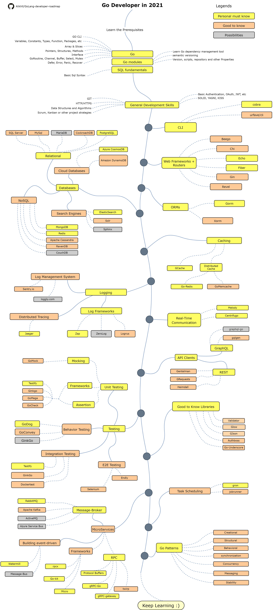

# Roadmap Go-разработчика

> Roadmap [Go](https://golang.org/)-разработчика в 2021 году:

Ниже вы можете увидеть диаграмму, демонстрирующую пути и библиотеки, которые вы можете выбрать, чтобы стать разработчиком Go. Я создал эту карту в качестве подсказки для всех тех, кто спрашивает меня: «Что я должен изучать дальше как Go-разработчик?»

[English](../../ReadMe.md)
[简体中文版](../zh-CN/ReadMe-zh-CN.md)
[繁體中文版](../zh-TW/ReadMe-zh-TW.md)
[日本語版](../ja-JP/ReadMe-ja-JP.md)
[Versão em Português do Brasil](../pt-BR/ReadMe-pt-BR.md)
[한국어](../ko-KR/ReadMe-ko-KR.md)
[Українська](../uk-UA/ReadMe-uk-UA.md)
[فارسی](../fa-IR/ReadMe-fa-IR.md)

## Дисклеймер

> Цель этого Roadmap'a - дать вам представление о мире Go. Он поможет вам, если вы не знаете что изучить дальше, но не будет побуждать вас к выбору того, что находится в тренде или является модным. Вы должны понимать, почему один инструмент подходит для некоторых случаев лучше, чем другой. А также понимать, что если инструмент находится в тренде, то это не всегда означает, что он лучше всего подходит для работы.

## Поставьте звёздочку! :star:

Если вам нравится этот проект или вы используете его для изучения, а также для построения своего решения, поставьте ему звезду. Спасибо!

## Roadmap

## Ресурсы

1. Подготовка

   - [Go](https://golangbot.com/)
   - [Go Modules](https://blog.golang.org/using-go-modules)
   - [SQL](https://www.w3schools.com/sql/default.asp)

2. Общие навыки разработчика

   - Изучите Git, создайте несколько репозиториев на GitHub, поделитесь своим кодом с другими людьми
   - Изучите HTTP(S)-протокол и методы запросов (GET, POST, PUT, PATCH, DELETE, OPTIONS)
   - Не бойтесь использовать Google (посмотрите курс [Power Searching with Google](http://www.powersearchingwithgoogle.com/))
   - Прочитайте несколько книг об алгоритмах и структурах данных
   - Узнайте о реализации базовой аутентификации
   - Изучите принципы SOLID, архитектурные паттерны и паттерны проектирования, и т.д.
   - Изучите основы тестирования ПО (Unit, Integration, E2E)

3. CLI-инструменты
   1. [cobra](https://github.com/spf13/cobra)
   2. [urfave/cli](https://github.com/urfave/cli)

4. Web-фреймворки + роутеры

   1. [Beego](https://github.com/astaxie/beego)
   2. [Chi](https://github.com/go-chi/chi)
   3. [Echo](https://github.com/labstack/echo)
   4. [Fiber](https://github.com/gofiber/fiber)
   5. [Gin](https://github.com/gin-gonic/gin)
   6. [Revel](https://github.com/revel/revel)

5. Базы данных

   1. Реляционные БД
      1. [SQL Server](https://www.microsoft.com/en-us/sql-server/sql-server-2017)
      2. [PostgreSQL](https://www.postgresql.org/)
      3. [MariaDB](https://mariadb.org/)
      4. [MySQL](https://www.mysql.com/)
      5. [CockroachDB](https://www.cockroachlabs.com/) 
   2. Облачные БД
      - [CosmosDB](https://docs.microsoft.com/en-us/azure/cosmos-db)
      - [DynamoDB](https://aws.amazon.com/dynamodb/)
   3. Поисковые системы
      - [ElasticSearch](https://www.elastic.co/)
      - [Solr](http://lucene.apache.org/solr/)
      - [Sphinx](http://sphinxsearch.com/)
   4. NoSQL
      - [MongoDB](https://www.mongodb.com/)
      - [Redis](https://redis.io/)
      - [Apache Cassandra](http://cassandra.apache.org/)
      - [RavenDB](https://github.com/ravendb/ravendb)
      - [CouchDB](http://couchdb.apache.org/)

6. ORM'ы

   1. [Gorm](https://github.com/go-gorm/gorm)
   2. [Xorm](https://github.com/go-xorm/xorm)

7. Кэширование

   1. [GCache](https://github.com/bluele/gcache)
   2. Распределённое кэширование
      1. [Go-Redis](https://github.com/go-redis/redis)
      2. [GoMemcached](https://github.com/bradfitz/gomemcache)

8. Логирование

   1. Лог-фреймворки
      - [Zap](https://github.com/uber-go/zap)
      - [ZeroLog](https://github.com/rs/zerolog)
      - [Logrus](https://github.com/sirupsen/logrus)
   2. Системы упраления логами
      - [Sentry.io](http://sentry.io)
      - [Loggly.com](https://loggly.com)
   3. Распределенная трассировка
      - [Jaeger](https://www.jaegertracing.io/)

9. Коммуникация в реальном времени
   1. [Socket.IO](https://socket.io/)

10. API-клиенты

    1. REST
       - [Gentleman](https://github.com/h2non/gentleman)
       - [GRequests](https://github.com/kennethreitz/grequests)
       - [heimdall](https://github.com/gojek/heimdall)
    2. [GraphQL](https://graphql.org/)
       - [gqlgen](https://github.com/99designs/gqlgen)
       - [graphql-go](https://github.com/graph-gophers/graphql-go)

11. Полезно знать

    - [Validator](https://github.com/go-playground/validator)
    - [Glow](https://github.com/pytorch/glow)
    - [GJson](https://github.com/tidwall/gjson)
    - [Authboss](https://github.com/volatiletech/authboss)
    - [Go-Underscore](https://github.com/ahl5esoft/golang-underscore)

12. Тестирование

    1. Unit-, Behavior-, Integration-тестирование
       1. [GoMock](https://github.com/golang/mock)
       2. [Testify](https://github.com/stretchr/testify)
       3. [GinkGo](https://github.com/onsi/ginkgo)
       4. [GoMega](https://github.com/onsi/gomega)
       5. [GoCheck](https://github.com/go-check/check)
       6. [GoDog](https://github.com/DATA-DOG/godog)
       7. [GoConvey](https://github.com/smartystreets/goconvey)
       8. [Dockertest](https://github.com/ory/dockertest)
    2. E2E-тестирование
       - [Selenium](https://github.com/tebeka/selenium)
       - [Endly](https://github.com/viant/endly)

13. Планировка заданий

    - [Gron](https://github.com/roylee0704/gron)
    - [JobRunner](https://github.com/bamzi/jobrunner)
    - [Gocron](https://github.com/go-co-op/gocron)

14. Микросервисы

    1. Брокер сообщений
       - [RabbitMQ](https://www.rabbitmq.com/tutorials/tutorial-one-go.html)
       - [Apache Kafka](https://kafka.apache.org/)
       - [ActiveMQ](https://github.com/apache/activemq)
       - [Azure Service Bus](https://docs.microsoft.com/en-us/azure/service-bus-messaging/service-bus-messaging-overview)
    2. Разработка message-driven приложений
       - [Watermill](https://github.com/ThreeDotsLabs/watermill)
       - [Message-Bus](https://github.com/vardius/message-bus)
    3. Фреймворки
         - [GoKit](https://github.com/go-kit/kit)
         - [go-zero](https://github.com/tal-tech/go-zero)
         - [Micro](https://github.com/micro/go-micro)
         - [rpcx](https://github.com/smallnest/rpcx)
    4. RPC
         - [Protocol Buffers](https://github.com/protocolbuffers/protobuf)
         - [gRPC-Go](https://github.com/grpc/grpc-go)
         - [gRPC-Gateway](https://github.com/grpc-ecosystem/grpc-gateway)
         - [Twirp](https://github.com/twitchtv/twirp)

15. [Go-Patterns](https://github.com/tmrts/go-patterns)

## Напоследок

Если вы считаете, что дорожную карту можно улучшить, пожалуйста откройте PR с любыми дополнениями или сообщениями об ошибках. Кроме того, я продолжаю улучшать это, так что вы, возможно, захотите отметить :star: этот репозиторий, чтобы зайти сюда потом.

Идея Roadmap'a взята у: [ASP.NET Core Developer Roadmap](https://github.com/MoienTajik/AspNetCore-Developer-Roadmap)

## Внести вклад

Эта карта построена с использованием [Draw.io](https://www.draw.io/). Файл проекта называется `golang-developer-roadmap-ru-RU.xml`. Чтобы изменить его, откройте draw.io, нажмите **Open Existing Diagram** и выберите `xml` файл с проектом. Это откроет Roadmap у вас. Измените его, загрузите и обновите изображение в Readme (экспортируйте PNG с 400% увеличением, а также уменьшите его с помощью [Compressor.io](https://compressor.io/compress)).

- Откройте Pull Request c улучшениями
- Обсудите идею в Issues
- Расскажите всем

## Лицензия

