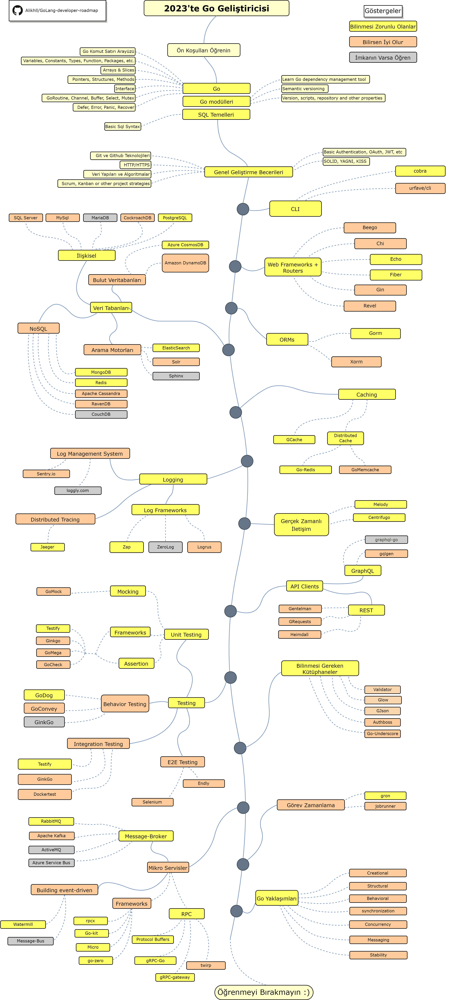

# Go Geliştiricisi Yol Haritası

> 2023'de [Go](https://golang.org) Geliştiricisi olmaya giden yol haritası:

Aşağıda, bir Go geliştiricisi olmak için izleyebileceğiniz yolları ve öğrenmek isteyeceğiniz kitaplıkları gösteren bir tablo bulabilirsiniz. Bu tabloyu bana soran herkes için bir ipucu olarak yaptım.
"*Bir Go geliştiricisi olarak bundan sonra ne öğrenmeliyim?*"

[Basitleştirilmiş Çince](./i18n/zh-CN/ReadMe-zh-CN.md)
[Geleneksel Çince](./i18n/zh-TW/ReadMe-zh-TW.md)
[Japonca](./i18n/ja-JP/ReadMe-ja-JP.md)
[Portekizce(Brezilya)](./i18n/pt-BR/ReadMe-pt-BR.md)
[Korece](./i18n/ko-KR/ReadMe-ko-KR.md)
[Rusça](./i18n/ru-RU/ReadMe-ru-RU.md)
[Ukraynaca](./i18n/uk-UA/ReadMe-uk-UA.md)
[Arapça](i18n/ar-IQ/ReadMe-ar-IQ.md)
[Türkçe](i18n/tr-TR/ReadMe-tr-TR.md)
## Feragatname

> Bu yol haritasının amacı size Go hakkında zihninizde bir temel oluşturmaktır. Bir sonraki adımda ne öğreneceğiniz konusunda kafanız karıştıysa, sizi abartılı ve gündemde olanı seçmenize teşvik etmek yerine, yol haritası size en doğrusu hakkında rehberlik edecektir. Bir Go aracının neden bazı durumlar için diğerinden daha uygun olduğuna dair biraz fikir geliştirmelisiniz. Yani bir aracın abartılı ve gündemde olması her zaman iş için en uygun olduğu anlamına gelmediğini unutmayın.

## Yıldızlamayı Unutmayın! :star:

Eğer projemizi beğendiyseniz veya projemiz işinize yarıyorsa ve hızlıca işe koyulduysanız, Yıldız vermeyi unutmayın. Teşekkürler!

## Yol Haritası

## Kaynaklar

1. Ön Koşullar

   - [Go](https://golangbot.com/)
   - [Go Modules](https://blog.golang.org/using-go-modules)
   - [SQL](https://www.w3schools.com/sql/default.asp)

2. Genel Geliştirme Becerileri

   - Git Öğrenin, Github üzerinde birkaç Repository oluşturun. Kodlarınızı diğer geliştiriciler ile paylaşın.
   - HTTP(S) protokolünü, istek yöntemlerine (GET, POST, PUT, PATCH, DELETE, OPTIONS) hakim olun.
   - Google'ı kullanın, Kullanmaktan çekinmeyin. [Power Searching with Google](http://www.powersearchingwithgoogle.com/)
   - Veri yapıları ve Algoritmalar için birkaç kitap okuyun.
   - Temel bir Kimlik Doğrulamanın uygulanması hakkında bilgi edinin.
   - Sağlam ilkeler, mimari ve tasarım kalıpları, vb. (Solid principles, architectural & design patterns, ecc)
   - Temel olarak yazılım testlerini öğrenin. (unit, integration, e2e)

3. Komut Satırı Arayüzü Araçları
   1. [cobra](https://github.com/spf13/cobra)
   2. [urfave/cli](https://github.com/urfave/cli)

4. Web İskeletleri ve Yönlendiriciler (Web Frameworks + Routers)

   1. [Beego](https://github.com/beego/beego)
   2. [Chi](https://github.com/go-chi/chi)
   3. [Echo](https://github.com/labstack/echo)
   4. [Fiber](https://github.com/gofiber/fiber)
   5. [Gin](https://github.com/gin-gonic/gin)
   6. [Revel](https://github.com/revel/revel)

5. Veri Tabanları

   1. İlişkisel
      1. [SQL Server](https://www.microsoft.com/en-us/sql-server/sql-server-2017)
      2. [PostgreSQL](https://www.postgresql.org/)
      3. [MariaDB](https://mariadb.org/)
      4. [MySQL](https://www.mysql.com/)
      5. [CockroachDB](https://www.cockroachlabs.com/) 
   2. Bulut Veri Tabanları
      - [CosmosDB](https://docs.microsoft.com/en-us/azure/cosmos-db)
      - [DynamoDB](https://aws.amazon.com/dynamodb/)
   3. Arama Motorları
      - [ElasticSearch](https://www.elastic.co/)
      - [Solr](http://lucene.apache.org/solr/)
      - [Sphinx](http://sphinxsearch.com/)
   4. NoSQL
      - [MongoDB](https://www.mongodb.com/)
      - [Redis](https://redis.io/)
      - [Apache Cassandra](http://cassandra.apache.org/)
      - [RavenDB](https://github.com/ravendb/ravendb)
      - [CouchDB](http://couchdb.apache.org/)

6. Veri Tabanı İskeletleri (ORMs)

   1. [Gorm](https://github.com/go-gorm/gorm)
   2. [Xorm](https://github.com/go-xorm/xorm)

7. Önbelleğe Alma (Caching)

   1. [GCache](https://github.com/bluele/gcache)
   2. Harici Caching Sunusu (Distributed Cache)
      1. [Go-Redis](https://github.com/go-redis/redis)
      2. [GoMemcached](https://github.com/bradfitz/gomemcache)

8. Kayıt Tutma (Logging)

   1. Kayıt İskeletleri (Log Frameworks)
      - [Zap](https://github.com/uber-go/zap)
      - [ZeroLog](https://github.com/rs/zerolog)
      - [Logrus](https://github.com/sirupsen/logrus)
   2. Kayıt Yönetim Sistemi (Log Management System)
      - [Sentry.io](http://sentry.io)
      - [Loggly.com](https://loggly.com)
   3. Dağıtılmış İzleme (Distributed Tracing)
      - [Jaeger](https://www.jaegertracing.io/)

9. Gerçek Zamanlı İletişim (Real-Time Communication)
   1. [Centrifugo](https://github.com/centrifugal/centrifugo)
   2. [Melody](https://github.com/olahol/melody)

10. API İstemcileri (API Clients)

    1. REST
       - [Gentleman](https://github.com/h2non/gentleman)
       - [GRequests](https://github.com/kennethreitz/grequests)
       - [heimdall](https://github.com/gojek/heimdall)
    2. [GraphQL](https://graphql.org/)
       - [gqlgen](https://github.com/99designs/gqlgen)
       - [graphql-go](https://github.com/graph-gophers/graphql-go)

11. Bilinirse İyi Olur

    - [Validator](https://github.com/go-playground/validator)
    - [Glow](https://github.com/pytorch/glow)
    - [GJson](https://github.com/tidwall/gjson)
    - [Authboss](https://github.com/volatiletech/authboss)
    - [Go-Underscore](https://github.com/ahl5esoft/golang-underscore)

12. Yazılım Testleri (Testing)

    1. Unit, Behavior, Integration Testing
       1. [GoMock](https://github.com/golang/mock)
       2. [Testify](https://github.com/stretchr/testify)
       3. [GinkGo](https://github.com/onsi/ginkgo)
       4. [GoMega](https://github.com/onsi/gomega)
       5. [GoCheck](https://github.com/go-check/check)
       6. [GoDog](https://github.com/DATA-DOG/godog)
       7. [GoConvey](https://github.com/smartystreets/goconvey)
       8. [Dockertest](https://github.com/ory/dockertest)
    2. E2E Testing
       - [Selenium](https://github.com/tebeka/selenium)
       - [Endly](https://github.com/viant/endly)

13. Görev Zamanlayıcı (Task Scheduling)

    - [Gron](https://github.com/roylee0704/gron)
    - [JobRunner](https://github.com/bamzi/jobrunner)
    - [Gocron](https://github.com/go-co-op/gocron)

14. Mikro Servisler (MicroServices)

    1. Mesaj Aracı (Message-Broker)
       - [RabbitMQ](https://www.rabbitmq.com/tutorials/tutorial-one-go.html)
       - [Apache Kafka](https://kafka.apache.org/)
       - [ActiveMQ](https://github.com/apache/activemq)
       - [Azure Service Bus](https://docs.microsoft.com/en-us/azure/service-bus-messaging/service-bus-messaging-overview)
    2. Kararlı Mesaj Yapısı (Building message-driven)
       - [Watermill](https://github.com/ThreeDotsLabs/watermill)
       - [Message-Bus](https://github.com/vardius/message-bus)
    3. İskeletler (Frameworks)
         - [GoKit](https://github.com/go-kit/kit)
         - [go-zero](https://github.com/tal-tech/go-zero)
         - [Micro](https://github.com/micro/go-micro)
         - [rpcx](https://github.com/smallnest/rpcx)
    4. Uzaktan Yordam Çağrısı (RPC)
         - [Protocol Buffers](https://github.com/protocolbuffers/protobuf)
         - [gRPC-Go](https://github.com/grpc/grpc-go)
         - [gRPC-Gateway](https://github.com/grpc-ecosystem/grpc-gateway)
         - [Twirp](https://github.com/twitchtv/twirp)

15. Go Yaklaşımları [Go-Patterns](https://github.com/tmrts/go-patterns)

## Özetle

Yol haritasının iyileştirilebileceğini düşünüyorsanız, lütfen herhangi bir güncelleme içeren bir PR açın ve sorunları gönderin. Ayrıca, bunu geliştirmeye devam edeceğim, bu yüzden tekrar ziyaret etmek için bu depoya yıldız eklemek isteyebilirsiniz.

Fikir : [ASP.NET Core Developer Roadmap](https://github.com/MoienTajik/AspNetCore-Developer-Roadmap)

## Katkı için

Yol haritası [Draw.io](https://www.draw.io/) kullanılarak oluşturulmuştur. Bu dosya `golang-developer-roadmap.xml` dosyasında mevcut. Değiştirmek için, draw.io sitesine gidin / uygulamayı açın, **Open Existing Diagram** butonuna basın ve xml dosyasını seçin. Yol haritası açılacaktır. Güncelleyin, görüntüleri yükleyin ve bir PR oluşturun (%400 Yakınlaştırmayla PNG olarak dışa aktarın ve [Compressor.io](https://compressor.io/compress) ile küçültün.).

- Yenilikler için Pull Request Oluşturun
- Sorunlar hakkında fikirinizi beyan edin
- Yayın

## Lisans

