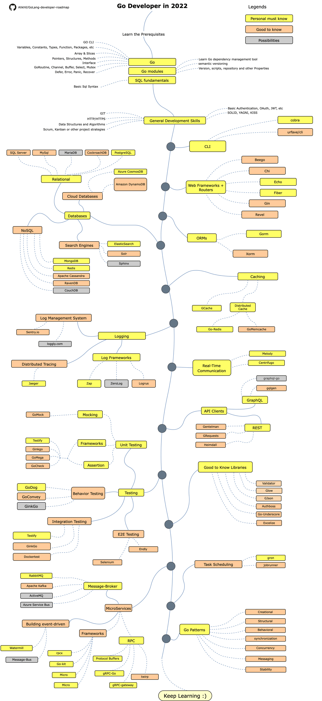

# Дорожня мапа розробника на Go

> Дорожня мапа для того, щоб стати [Go](https://golang.org/) розробником у 2020 році:

Нижче Ви можете знайти діаграму, яка демонструє шляхи та бібліотеки, які Ви можете вибрати для того, щоб стати Go розробником. Я зробив цю діаграму в якості підказки для всіх, хто запитує мене: «Що я повинен вивчити далі як розробник на Go?»

[English](../../ReadMe.md)
[简体中文版](../zh-CN/ReadMe-zh-CN.md)
[繁體中文版](../zh-TW/ReadMe-zh-TW.md)
[日本語版](../ja-JP/ReadMe-ja-JP.md)
[Versão em Português do Brasil](../pt-BR/ReadMe-pt-BR.md)
[한국어](../ko-KR/ReadMe-ko-KR.md)
[Русский](../ru-RU/ReadMe-ru-RU.md)
[فارسی](../fa-IR/ReadMe-fa-IR.md)

## Застереження

> Мета цієї дорожньої мапи дати Вам уявлення про світ Go. Вона допоможе Вам, якщо Ви не знаєте що вивчити далі, замість того, щоб спонукати вас до вибору того, що знаходиться у тренді або є модним. Ви повинні розуміти, чому один інструмент підходить для деяких випадків краще, ніж інший. А також розуміти, що інструмент, який знаходиться у тренді, не завжди означає, що він краще підходить для роботи.

## Дай зірку! :star:

Якщо Вам подобається цей проект або Ви використовуєте його для вивчення, та для побудови власних рішень, поставте йому зірку. Дякуємо!

## Дорожня мапа

## Ресурси

1. Передумови

   - [Go](https://golangbot.com/)
   - [Go Modules](https://blog.golang.org/using-go-modules)
   - [SQL](https://www.w3schools.com/sql/default.asp)

2. Загальні Навички Розробки

   - Вивчіть GIT, створіть кілька репозиторіїв на GitHub, поділіться своїм кодом з іншими людьми
   - Вивчіть протокол HTTP(S), методи запитів (GET, POST, PUT, PATCH, DELETE, OPTIONS)
   - Не бійтесь використовувати Google, [Power Searching with Google](http://www.powersearchingwithgoogle.com/)
   - Прочитайте декілька книг про алгоритми та структури даних
   - Дізнайтеся про реалізацію базової аутентифікації
   - Вивчіть принципи SOLID, архітектурні шаблони та шаблони проектування, і тому подібне...
   - Вивчіть основи тестування ПЗ (Unit, Integration, E2E)

3. Інструменти CLI
   1. [cobra](https://github.com/spf13/cobra)
   2. [urfave/cli](https://github.com/urfave/cli)

4. Веб-фреймворки + Маршрутизатори

   1. [Beego](https://github.com/astaxie/beego)
   2. [Chi](https://github.com/go-chi/chi)
   3. [Echo](https://github.com/labstack/echo)
   4. [Fiber](https://github.com/gofiber/fiber)
   5. [Gin](https://github.com/gin-gonic/gin)
   6. [Revel](https://github.com/revel/revel)

5. Бази даних

   1. Реляційні
      1. [SQL Server](https://www.microsoft.com/en-us/sql-server/sql-server-2017)
      2. [PostgreSQL](https://www.postgresql.org/)
      3. [MariaDB](https://mariadb.org/)
      4. [MySQL](https://www.mysql.com/)
      5. [CockroachDB](https://www.cockroachlabs.com/) 
   2. Хмарні БД
      - [CosmosDB](https://docs.microsoft.com/en-us/azure/cosmos-db)
      - [DynamoDB](https://aws.amazon.com/dynamodb/)
   3. Пошукові системи
      - [ElasticSearch](https://www.elastic.co/)
      - [Solr](http://lucene.apache.org/solr/)
      - [Sphinx](http://sphinxsearch.com/)
   4. NoSQL
      - [MongoDB](https://www.mongodb.com/)
      - [Redis](https://redis.io/)
      - [Apache Cassandra](http://cassandra.apache.org/)
      - [RavenDB](https://github.com/ravendb/ravendb)
      - [CouchDB](http://couchdb.apache.org/)

6. ORMs

   1. [Gorm](https://github.com/go-gorm/gorm)
   2. [Xorm](https://github.com/go-xorm/xorm)

7. Кешування

   1. [GCache](https://github.com/bluele/gcache)
   2. Розподілений кеш
      1. [Go-Redis](https://github.com/go-redis/redis)
      2. [GoMemcached](https://github.com/bradfitz/gomemcache)

8. Логування

   1. Фреймворки
      - [Zap](https://github.com/uber-go/zap)
      - [ZeroLog](https://github.com/rs/zerolog)
      - [Logrus](https://github.com/sirupsen/logrus)
   2. Система управління журналами
      - [Sentry.io](http://sentry.io)
      - [Loggly.com](https://loggly.com)
   3. Розподілене трасування
      - [Jaeger](https://www.jaegertracing.io/)

9. Спілкування в Режимі Реального Часу
   1. [Socket.IO](https://socket.io/)

10. Клієнти API

    1. REST
       - [Gentleman](https://github.com/h2non/gentleman)
       - [GRequests](https://github.com/kennethreitz/grequests)
       - [heimdall](https://github.com/gojek/heimdall)
    2. [GraphQL](https://graphql.org/)
       - [gqlgen](https://github.com/99designs/gqlgen)
       - [graphql-go](https://github.com/graph-gophers/graphql-go)

11. Добре знати

    - [Validator](https://github.com/go-playground/validator)
    - [Glow](https://github.com/pytorch/glow)
    - [GJson](https://github.com/tidwall/gjson)
    - [Authboss](https://github.com/volatiletech/authboss)
    - [Go-Underscore](https://github.com/ahl5esoft/golang-underscore)

12. Тестування

    1. Тестування Unit, Behavior, Integration
       1. [GoMock](https://github.com/golang/mock)
       2. [Testify](https://github.com/stretchr/testify)
       3. [GinkGo](https://github.com/onsi/ginkgo)
       4. [GoMega](https://github.com/onsi/gomega)
       5. [GoCheck](https://github.com/go-check/check)
       6. [GoDog](https://github.com/DATA-DOG/godog)
       7. [GoConvey](https://github.com/smartystreets/goconvey)
       8. [Dockertest](https://github.com/ory/dockertest)
    2. Тестування E2E
       - [Selenium](https://github.com/tebeka/selenium)
       - [Endly](https://github.com/viant/endly)

13. Планування завдань

    - [Gron](https://github.com/roylee0704/gron)
    - [JobRunner](https://github.com/bamzi/jobrunner)
    - [Gocron](https://github.com/go-co-op/gocron)

14. Мікросервіси

    1. Брокер Повідомлень
       - [RabbitMQ](https://www.rabbitmq.com/tutorials/tutorial-one-go.html)
       - [Apache Kafka](https://kafka.apache.org/)
       - [ActiveMQ](https://github.com/apache/activemq)
       - [Azure Service Bus](https://docs.microsoft.com/en-us/azure/service-bus-messaging/service-bus-messaging-overview)
    2. Побудова на Основі Повідомлень
       - [Watermill](https://github.com/ThreeDotsLabs/watermill)
       - [Message-Bus](https://github.com/vardius/message-bus)
    3. Фреймворки
         - [GoKit](https://github.com/go-kit/kit)
         - [go-zero](https://github.com/tal-tech/go-zero)
         - [Micro](https://github.com/micro/go-micro)
         - [rpcx](https://github.com/smallnest/rpcx)
    4. RPC
         - [Protocol Buffers](https://github.com/protocolbuffers/protobuf)
         - [gRPC-Go](https://github.com/grpc/grpc-go)
         - [gRPC-Gateway](https://github.com/grpc-ecosystem/grpc-gateway)
         - [Twirp](https://github.com/twitchtv/twirp)

15. [Go-Patterns](https://github.com/tmrts/go-patterns)

## Підсумки

Якщо Ви вважаєте, що дорожню мапу можна поліпшити, будь ласка, відкрийте запит на злиття (Pull Request) з будь-якими пропозиціями або звітами про помилки. Крім того, я продовжуватиму вдосконалювати репозиторій, тому, можливо, Ви захочете позначити це сховище зірочкою для повторного відвідування. 

Ідея дорожньої карти взята у: [ASP.NET Core Developer Roadmap](https://github.com/MoienTajik/AspNetCore-Developer-Roadmap)

## Внесок

Дорожня мапа побудована з використанням [Draw.io](https://www.draw.io/). Файл проекту `golang-developer-roadmap-uk-UA.xml`. Щоб модифікувати його, відкрийте draw.io, натисніть **Відкрийте існуючу діаграму** та виберіть `xml` файл с проектом. Таким чином, Ви відкриєте дорожню мапу. Оновіть її та завантажте оновлене зображення в Readme (експортуйте PNG з масштабом 400% а також стисніть його за допомогою [Compressor.io](https://compressor.io/compress)).

- Відкрийте пул-реквест c поліпшеннями
- Обговоріть ідею в Issues
- Поширюйте знайомим

## Ліцензія

