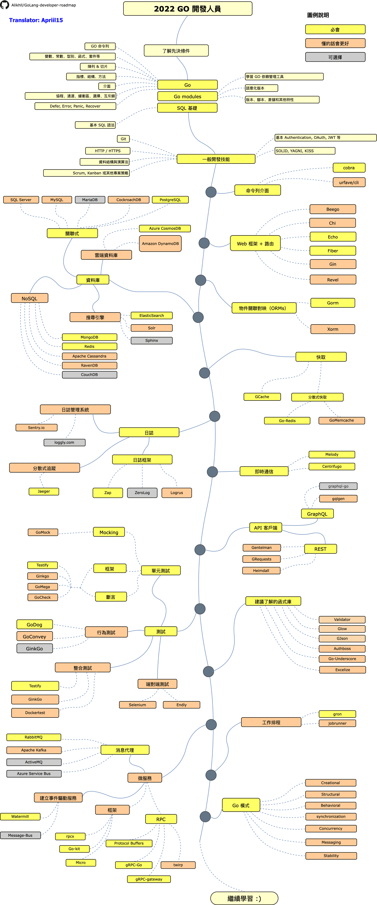

# Go 開發者路線圖

> 在 2021 年成為一名 [Go](https://golang.org/) 開發者的路線圖：

下面有一個路線圖，如果你想要成為一名 Go 語言開發者的話，你可以沿著這張圖裡面的路徑去學習，裡面紀錄了一些你可能也想學習的函式庫。當你問到：「我想成為一名 Go 語言開發者，接下來我要學些什麼？」，我做的這個路線圖就是一個很好的建議。

[English](../../ReadMe.md)
[简体中文](../zh-CN/ReadMe-zh-CN.md)
[日本語](../ja-JP/ReadMe-ja-JP.md)
[Versão em Português do Brasil](../pt-BR/ReadMe-pt-BR.md)
[한국어](../ko-KR/ReadMe-ko-KR.md)
[Русский](../ru-RU/ReadMe-ru-RU.md)
[Українська](../uk-UA/ReadMe-uk-UA.md)
[فارسی](../fa-IR/ReadMe-fa-IR.md)

## 免責聲明

> 本路線圖的目的是讓你看到學習 Go 語言的一個全景圖。在你對接下来要學習什麼感到困惑的时候，這個路線圖會給你一些指導，而不是鼓勵你去選擇當下流行的東西。你需要逐漸了解為什麼一個工具可能會比另一個工具更適合某些場景。但請記住，流行的東西並不意味著一定適合你的工作。

## 給我一個 Star！ :star:

如果您喜歡或者正在使用這個專案來學習或者開始你的計畫，請給這專案一個 star，謝謝！

## 路線圖

## 資源

1. 先決條件

   - [Go](https://golangbot.com/)
   - [Go Modules](https://blog.golang.org/using-go-modules)
   - [SQL](https://www.w3schools.com/sql/default.asp)

2. 一般開發技能

   - 學習 GIT，在 GitHub 上建立一些倉儲，與其它人分享你的程式碼
   - 了解 HTTP(S) 協議，request 方法（GET, POST, PUT, PATCH, DELETE, OPTIONS）
   - 不要害怕使用 Google，[Google 搜索的力量](http://www.powersearchingwithgoogle.com/)
   - 看一些關於資料結構以及演算法的書籍
   - 學習關於驗證的基礎實現
   - SOLID 原則、架構、設計模式等
   - 基本的軟體測試（單元、整合、端對端）

3. 命令列工具

   1. [cobra](https://github.com/spf13/cobra)
   2. [urfave/cli](https://github.com/urfave/cli)

4. Web 框架 + 路由

   1. [Beego](https://github.com/astaxie/beego)
   2. [Chi](https://github.com/go-chi/chi)
   3. [Echo](https://github.com/labstack/echo)
   4. [Fiber](https://github.com/gofiber/fiber)
   5. [Gin](https://github.com/gin-gonic/gin)
   6. [Revel](https://github.com/revel/revel)

5. 資料庫

   1. 關聯式
      1. [SQL Server](https://www.microsoft.com/en-us/sql-server/sql-server-2017)
      2. [PostgreSQL](https://www.postgresql.org/)
      3. [MariaDB](https://mariadb.org/)
      4. [MySQL](https://www.mysql.com/)
      5. [CockroachDB](https://www.cockroachlabs.com/)
   2. 雲端資料庫
      - [CosmosDB](https://docs.microsoft.com/en-us/azure/cosmos-db)
      - [DynamoDB](https://aws.amazon.com/dynamodb/)
   3. 搜索引擎
      - [ElasticSearch](https://www.elastic.co/)
      - [Solr](http://lucene.apache.org/solr/)
      - [Sphinx](http://sphinxsearch.com/)
   4. NoSQL
      - [MongoDB](https://www.mongodb.com/)
      - [Redis](https://redis.io/)
      - [Apache Cassandra](http://cassandra.apache.org/)
      - [RavenDB](https://github.com/ravendb/ravendb)
      - [CouchDB](http://couchdb.apache.org/)

6. 物件關聯對映

   1. [Gorm](https://github.com/go-gorm/gorm)
   2. [Xorm](https://github.com/go-xorm/xorm)

7. 快取

   1. [GCache](https://github.com/bluele/gcache)
   2. 分散式快取
      - [Go-Redis](https://github.com/go-redis/redis)
      - [GoMemcached](https://github.com/bradfitz/gomemcache)

8. 日誌

   1. 日誌框架
      - [Zap](https://github.com/uber-go/zap)
      - [ZeroLog](https://github.com/rs/zerolog)
      - [Logrus](https://github.com/sirupsen/logrus)
   2. 日誌管理系統
      - [Sentry.io](http://sentry.io)
      - [Loggly.com](https://loggly.com)
   3. 分散式追蹤
      - [Jaeger](https://www.jaegertracing.io/)

9. 即時通訊

   1. [Socket.IO](https://socket.io/)

10. API 客戶端

    1. REST
       - [Gentleman](https://github.com/h2non/gentleman)
       - [GRequests](https://github.com/kennethreitz/grequests)
       - [heimdall](https://github.com/gojek/heimdall)
    2. [GraphQL](https://graphql.org/)
       - [gqlgen](https://github.com/99designs/gqlgen)
       - [graphql-go](https://github.com/graph-gophers/graphql-go)

11. 最好知道

    - [Validator](https://github.com/go-playground/validator)
    - [Glow](https://github.com/pytorch/glow)
    - [GJson](https://github.com/tidwall/gjson)
    - [Authboss](https://github.com/volatiletech/authboss)
    - [Go-Underscore](https://github.com/ahl5esoft/golang-underscore)

12. 測試

    1. 單元、行為、整合測試
       1. [GoMock](https://github.com/golang/mock)
       2. [Testify](https://github.com/stretchr/testify)
       3. [GinkGo](https://github.com/onsi/ginkgo)
       4. [GoMega](https://github.com/onsi/gomega)
       5. [GoCheck](https://github.com/go-check/check)
       6. [GoDog](https://github.com/DATA-DOG/godog)
       7. [GoConvey](https://github.com/smartystreets/goconvey)
       8. [Dockertest](https://github.com/ory/dockertest)
    2. 端對端測試
       - [Selenium](https://github.com/tebeka/selenium)
       - [Endly](https://github.com/viant/endly)

13. 工作排程

    - [Gron](https://github.com/roylee0704/gron)
    - [JobRunner](https://github.com/bamzi/jobrunner)
    - [Gocron](https://github.com/go-co-op/gocron)

14. 微服務

    1. 消息代理
       - [RabbitMQ](https://www.rabbitmq.com/tutorials/tutorial-one-go.html)
       - [Apache Kafka](https://kafka.apache.org/)
       - [ActiveMQ](https://github.com/apache/activemq)
       - [Azure Service Bus](https://docs.microsoft.com/en-us/azure/service-bus-messaging/service-bus-messaging-overview)
    2. 建立事件驅動服務
       - [Watermill](https://github.com/ThreeDotsLabs/watermill)
       - [Message-Bus](https://github.com/vardius/message-bus)
    3. 框架
       - [GoKit](https://github.com/go-kit/kit)
       - [Micro](https://github.com/micro/go-micro)
       - [rpcx](https://github.com/smallnest/rpcx)
    4. RPC
       - [Protocol Buffers](https://github.com/protocolbuffers/protobuf)
       - [gRPC-Go](https://github.com/grpc/grpc-go)
       - [gRPC-Gateway](https://github.com/grpc-ecosystem/grpc-gateway)
       - [Twirp](https://github.com/twitchtv/twirp)

15. [Go 模式](https://github.com/tmrts/go-patterns)

## 最後

如果您認為該路線圖有待改進，請務必提交 PR 或者發 Issue。當然，我會持續地改善它，所以你可以給這個倉儲點個 star 以便回訪。

想法來自：[ASP.NET Core Developer Roadmap](https://github.com/MoienTajik/AspNetCore-Developer-Roadmap)

## 貢獻

這個路線圖是用 [Draw.io](https://www.draw.io/) 做的。專案的檔案可以在這邊找到 `golang-developer-roadmap-zh-TW.xml`。您如果想要修改它，您可以進入 [Draw.io](https://www.draw.io/) 點擊**打開已有圖表**，並且選擇這個 `xml` 檔案。它會為您打開這個路線圖。更新，並且上傳，以及更新該 ReadMe 中的對應圖片，然後提交 PR（以 `400%` 的縮放輸出 `PNG` 以及使用 [Compressor.io](https://compressor.io/compress) 來壓縮）。

- 用 PR 提交改善
- 在 Issue 中討論想法
- 傳播這個圖表

## License

